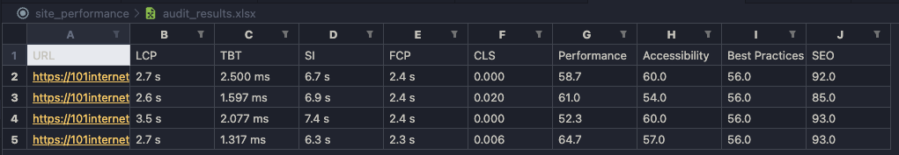

# Site Performance
Анализ производительности сайта с использованием Google Lighthouse

## Описание проекта

Скрипт для измерения производительности сайтов по списку URL с помощью Lighthouse.

## Начало работы

Клонируйте репозиторий:

```bash
git clone https://github.com/Tciganskybaron/site_performance.git
```

## Предварительные требования

Для работы необходимы [node](https://nodejs.org/en/)
и [npm](https://docs.npmjs.com/downloading-and-installing-node-js-and-npm)


## Установка

Выполните следующую команду в корневой директории проекта:

```
npm install
```

## Требования к файлу для парсинга 'TEST.txt'

URL-адреса должны быть размещены друг за другом без пробелов и запятых:

```
https://101internet.ru/ekaterinburg/about/partners
https://101internet.ru/ekaterinburg/about/terms-of-use
https://101internet.ru/ekaterinburg/actions
https://101internet.ru/ekaterinburg/address
```
## Логика

Для каждого URL проводится 5 аудитов. Отбрасываются наихудший и наилучший результаты. 
Среднее значения вычисляется по оставшимся трём показателям.

Чтобы получить наихудший результат из пяти аудитов, необходимо установить флаг WORST в значение true.

## Запуск скрипта

Укажите правильный файл для парсинга в index.js:

```
	// Указываем файл с Url 'Test.txt'
	const page = await readUrlsFromFile('Test.txt');
```

Если требуется получить наихудшие показатели, измените значение флага WORST на true:
```
  // Флаг для получения наихудшего результата
	const WORST = true;
```

Запустите скрипт, выполнив команду:

```
npm run start
```
После завершения работы скрипта в корневой папке проекта появится файл audit_results.xlsx. Сохраните его в безопасном месте, так как он будет перезаписан при новом запуске скрипта.


## Результаты аудита

Результаты аудита будут сохранены в файле `audit_results.xlsx`. Пример вывода данных аудита представлен ниже:



*URL* - Адрес веб-страницы, которая тестировалась.
*LCP (Largest Contentful Paint)* - Время от момента загрузки страницы до момента, когда основной контент был загружен и отображен на экране.
*TBT (Total Blocking Time)* - Общее время, в течение которого загрузка страницы блокировала ввод пользователя.
*SI (Speed Index)* - Индекс скорости загрузки контента страницы.
*FCP (First Contentful Paint)* - Время от момента загрузки страницы до момента, когда первый контент (текст или изображение) был отображен на экране.
*CLS (Cumulative Layout Shift)* - Совокупный сдвиг макета, измеряющий стабильность визуального отображения страницы.
*Performance* - Общий показатель производительности страницы.
*Accessibility* - Оценка доступности страницы для пользователей с ограниченными возможностями.
*Best Practices* - Оценка соблюдения лучших практик веб-разработки.
*SEO* - Оценка оптимизации страницы для поисковых систем.

Результаты помогут вам идентифицировать области для улучшения производительности и доступности вашего сайта.

## Зависимости

 Node.js 
 npm 

## Автор

- [Никита Тихонов](https://github.com/Tciganskybaron)
